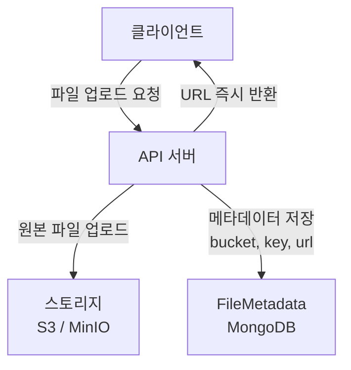
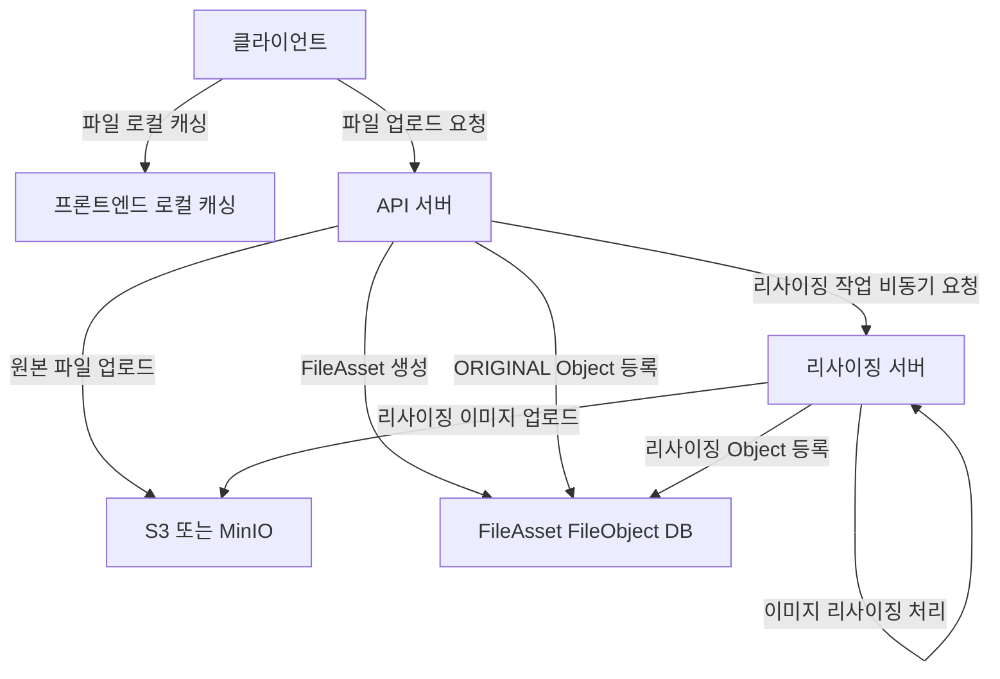

# 이미지 리사이징 도입 준비

## 이미지 리사이징을 도입하게 된 이유

### 상황 예시

- 친구 목록을 조회할 때 각 친구의 프로필 이미지를 함께 조회한다.
- 현재 구조에서는 프로필 이미지 원본 파일을 그대로 내려준다.
- 이 상태가 유지되면 다음 문제가 발생한다.
  - 프로필 목록처럼 한 화면에서 다수의 이미지가 동시에 로딩됨
  - 원본 이미지는 해상도와 용량이 불필요하게 큼
  - 결과적으로:
    - 네트워크 트래픽 증가
    - S3(또는 Object Storage) 전송 비용 증가
    - 화면 로딩 지연

따라서 화면 용도에 맞는 크기의 이미지를 제공하기 위해 이미지 리사이징 도입이 필요해졌다.

## 이미지 리사이징 도입의 기대 효과

### 장점

- 네트워크 부담 감소
- 작은 이미지 전송으로 트래픽 감소
- 비용 절감
- S3 다운로드 비용 감소
- 로딩 속도 개선
- 리스트/프로필 화면 UX 개선

### 단점

- 구현 복잡도 증가
- 비동기 처리, 상태 관리 필요
- 하드웨어 리소스 사용 증가
- 리사이징은 CPU 사용량이 높은 작업
- 운영 복잡도 증가
- 워커 인스턴스, 실패/재시도 관리 필요

## 도입을 위한 테이블 설계

### 기존 파일 저장 방식

- FileMetadata 단일 테이블에서 모든 파일 정보 관리

### 기존 FileMetadata 구조의 문제점

1. URL을 저장함
   - CDN 도입, 도메인 변경 시 전체 데이터 수정 필요
2. 단일 URL만 표현 가능
   - 여러 사이즈/포맷(WebP 등) 확장 불가
3. 화면별 요구 사항 대응 불가
   - 프로필 목록용 이미지
   - 프로필 상세용 이미지

## 개선된 구조: FileAsset / FileObject 분리

### 설계 방향

- 파일을 단일 URL이 아닌 자산(Asset) 개념으로 관리
- 실제 저장되는 파일은 variant 단위로 분리

### FileAsset (파일 에셋)

- 논리적 파일 단위
- 하나의 업로드를 대표
- 원본 + 모든 리사이징본을 묶는 루트 엔티티

#### 역할

- 다른 도메인(Profile, Chat 등)에서 참조하는 대상
- 상태 관리(PROCESSING / READY / FAILED)

### FileObject (파일 오브젝트)

- 실제 스토리지에 저장된 파일 단위
- 사이즈/포맷별로 row가 생성됨

#### 특징

- ORIGINAL, THUMB_200, W_400 등 variant별 row
- 사이즈가 늘어나면 row가 늘어나는 구조
- URL은 저장하지 않고 요청 시 계산

## 기존 파일 업로드 흐름

## 리사이징 도입 후 파일 업로드 흐름

## 정리

- 이미지 리사이징 도입은 단순 성능 최적화가 아니다.
- 파일을 URL 중심 모델에서 자산 중심 모델로 전환하는 작업이다.
- 이 구조를 통해:
  - 다양한 사이즈 요구 대응
  - 비용/성능 최적화
  - 향후 CDN, 포맷 변경에도 유연한 확장
- 리사이징 도입은 기능 추가가 아니라 파일 도메인 전체를 재정의하는 작업이다
